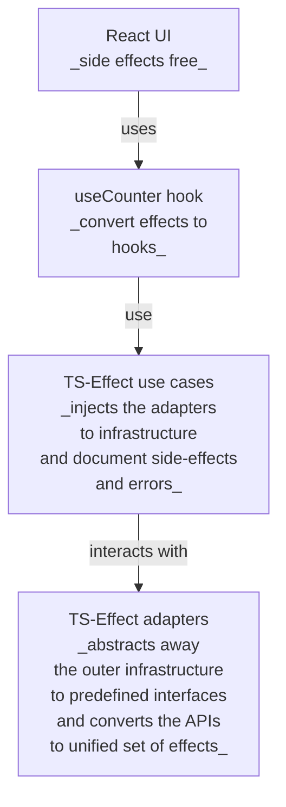
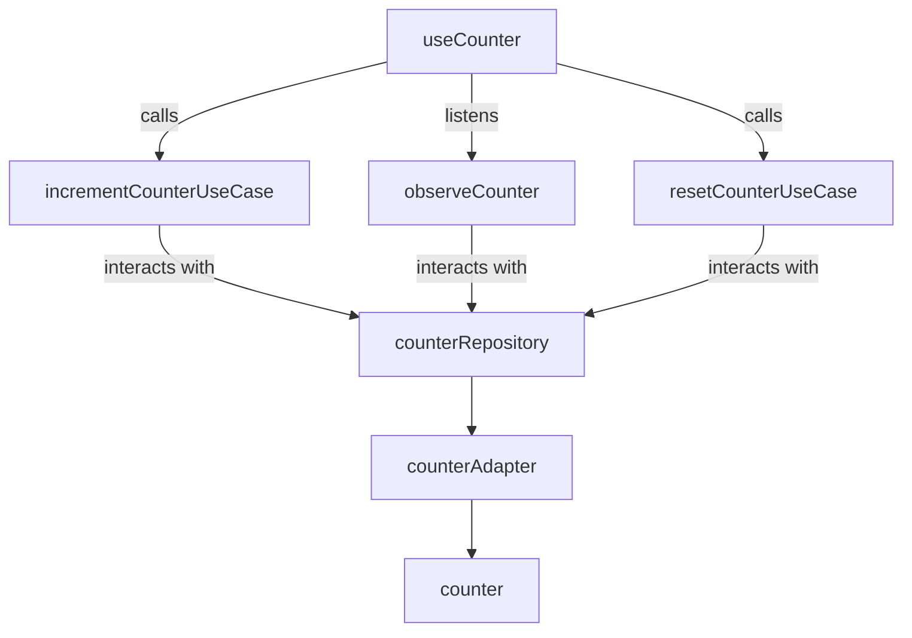

# TS-Effect micro + React + TypeScript + Vite

This demo app derived from the minimal setup to get Vite working and its purpose is to outline the basic structure of a Effect-TS micro library adopted to React according to
CA-principles.

## Why TS-Effect micro?

The primary purpose of using TS-Effect is to get fine-grained control over errors of the asynchronous code and secondary is to get better documentation and isolation of the side effects.

TS-Micro is a variant of the Effect-TS library that is reduced to the set of the futures to serve these purposes and still to have the minimal footprint.

## Architecture



## Application layer

Application layer presented by 3 functions playing the role use cases:

- `incrementCounterUseCase` - increments the counter value
- `observeCounter` - observes the counter value
- `resetCounterUseCase` - resets the counter value

and one repository:
- `counterRepository` - the inteface defines methods expected by the use cases to interact with the outer world (e.g. database, API, etc.)

## Driving adapters
- `useCounter` - React hook that updated React state according to the `observeCounter` use case and updates the outer world by calling the `incrementCounterUseCase` and `resetCounterUseCase` use cases.

##  Driven adapters
- counterAdapter - is the instance of the `counterRepository` that implements the methods to interact with the counter service value in memory.

## 3rd party service, immitating the outer infrastructure
 - `counter` - and object with the async  Promise-based methods modifier, sync modifier and one Promise-based getter.



## Implementation details
### [Driven adapters](src/infra/counter-adapter.ts)

On the infrastructure adapters level the sync and async methods are wrapped into the effects to unify the APIs and to provide the types errors.


```typescript
export const counterAdapter: CounterRepository = {
  incrementCounter: () =>
    Micro.tryPromise({
      try: () => counter.incrementCounter(),
      catch: (error) =>
        error instanceof Error ? error.message : String(error),
    }),
  getCounter: () => Micro.promise(() => counter.getCounter()),
  resetCounter: () => Micro.succeed(counter.resetCounter()),
};
```

### [Use cases](src/application)
In this simplest application the role of the use cases is to consume the dependencies from the context (particularly the driven adapters) and orchestrate them in the terms of the domain and business logic to provide the valueble functionality to the application.

```typescript
const incrementCounterUseCase = Micro.gen(function* () {
  const counterAdapter = yield* Micro.service(CounterAdapterTag);
  yield* counterAdapter.incrementCounter();
})
```
### [Repositories/Driven adapters ports](src/application/repo/counter-repos.ts)
Besides the trivial interface definition, the repository is exposed to the **Micro** environment as a `Context.Tag` so their concrete implementations can be located in the `Context` and injected into the use cases.

```typescript
export const CounterAdapterTag = Context.Tag<CounterRepository>(
  "CounterAdapterTag",
  (counterAdapter) => counterAdapter
);
```

### [React hooks/Driving adapters](src/application/useCounter.ts)
React custom hook is where the **Micro** effects are terminated and converted to the React state updates. 

```typescript
  const [count, setCount] = useState<number>(0);
  const [error, setError] = useState<string | null>(null);

  const incrementCounter = () => {
    microRunPromise(
      Micro.gen(function* () {
        const result = yield* Micro.either(incrementCounterUseCase)
        yield* Either.match(result, {
          onLeft: (s: string) => Micro.sync(() => setError(s)),
          onRight: () => Micro.sync(() => setError(null)),
        });
      })
    );
  };
```


### [Micro-runtime](src/infra/micro-runtime.ts) 
**Micro** does not have layering and its own runtime, to provide the dependencies to the effects, but it stil has the `Context` that can be easyly populated with the application life-time singletons. This where the driven adapters ports meet their implementations.

```typescript
import { Context, Micro } from "effect";
import { counterAdapter, CounterAdapterTag } from "./counter-adapter";

const appContext = Context.make(CounterAdapterTag, counterAdapter);

// const appContext = Context.merge(
//   Context.make(CounterAdapterTag, counterAdapter),
//   Context.make(UserServiceTag, userService)
// );
```
and used in the the wrappers to call the effects
```typescript
export const microRunPromise = <A, E, R>(
  eff: Micro.Micro<A, E, R>
): Promise<A> =>
  Micro.runPromise(Micro.provideContext(eff, appContext as Context.Context<R>));
```

## Features
Besides the side effects orchestration and error handling, the **Micro** provides the powerful **Fiber**-s subsystem to run backround tasks in extremely natural way:

```typescript
  useEffect(() => {
    let isMounted = true;

    const fiber = microFork(
      Micro.gen(function* () {
        while (isMounted) {
          const value = yield* observeCounter;
          yield* Micro.sync(() => setCount(value));
        }
      })
    );

    return () => {
      isMounted = false;
      microRunPromise(Micro.fiberInterrupt(fiber));
    };
  }, []);
```

## Sumary

Redusing the footprint from ~300kB to ~50kB (downlad [stats.html](stats.html) for the detail view), does not seem to be significant achivement, but still can be required in some cases, where the size of the bundle is critical.

The only component that I missed from the whole Effect-TS library thow was the Layiring but in the simple case it was easy to implement it by hand with [micro-runtime](src/infra/micro-runtime.ts).

The main and actually the single disadvantage of the **Micro** is the terrible verbosity and rather "write-only" style of the code, that generally is common for the functional programming. 

This requires the thoughtful approaches to the coding style and some "conventions" to make the code readable and maintainable.
